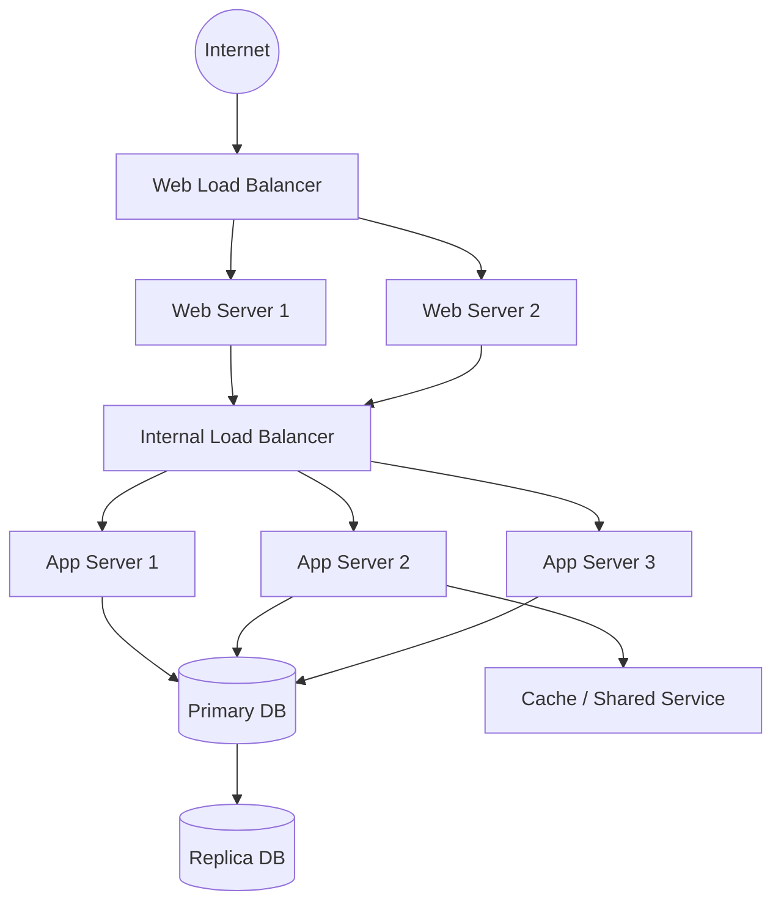

## 배경

AWS에서 네트워크 아키텍처를 처음 정리할 때 가장 많이 보게 되는 형태 중 하나가 `3-tier architecture`다.

이 구조는 말 그대로 계층을 3개로 나누는 방식이다.

- Web tier
- App tier
- Database tier

그리고 이 3개를 그냥 논리적으로만 나누는 게 아니라, **서브넷과 보안 경계까지 같이 나누는 것**이 핵심이다.

이번 글은 그림 기준으로, AWS에서 전통적인 3-tier architecture를 어떻게 이해하면 되는지 정리한다.

아래처럼 보면 전체 흐름이 한 번에 잡힌다.



## 환경

그림에서 보이는 구조를 먼저 말로 풀면 이렇다.

- 바깥 큰 경계는 `VPC`
- 그 안에 `2개 Availability Zone`
- 각 AZ 안에 `3개 Subnet`
- 즉 전체적으로는 `2 AZ x 3 Tier` 구조

이걸 계층 기준으로 다시 보면:

- 위쪽: Web tier
- 중간: App tier
- 아래쪽: DB tier

형태다.

## 핵심 내용

### 1. 바깥 큰 박스는 VPC다

그림에서 가장 바깥 보라색 경계는 `VPC`로 이해하면 된다.

이 안이 하나의 사설 네트워크 공간이고, 모든 tier는 이 VPC 안에 들어간다.

즉:

- Web 서버도 VPC 안
- App 서버도 VPC 안
- DB도 VPC 안

이라는 뜻이다.

3-tier architecture는 결국 **하나의 VPC 안에서 역할이 다른 네트워크 구역을 분리하는 구조**라고 보면 된다.

### 2. 점선으로 나뉜 두 기둥은 AZ 분산이다

그림에서 좌우로 나뉜 두 개의 점선 영역은 보통 `Availability Zone`을 의미한다.

이게 중요한 이유는 단순히 예쁘게 나눈 게 아니라, **장애 대응과 가용성 확보** 때문이다.

예를 들어 한 AZ에 문제가 생겨도:

- 다른 AZ의 Web tier
- 다른 AZ의 App tier
- 다른 AZ의 DB tier

가 살아 있으면 전체 서비스가 완전히 멈추지 않게 설계할 수 있다.

그래서 3-tier architecture를 AWS에서 얘기할 때는, 계층 분리만큼이나 **Multi-AZ 배치**가 같이 따라온다.

### 3. 위쪽은 Web tier다

맨 위 서브넷은 보통 `Web tier`다.

전통적으로 이 구간은 외부 요청과 가장 먼저 만나는 계층이다.

AWS에서는 보통 아래 같은 리소스가 여기에 놓인다.

- Internet-facing ALB
- Bastion Host
- Public-facing Web Server

그림만 보면 가장 위 tier가 상대적으로 외부와 가까운 위치에 있다.  
그래서 이 tier는 보통 **Public Subnet 또는 외부 진입점이 있는 계층**으로 이해하면 된다.

즉, 인터넷에서 들어오는 트래픽이 바로 DB로 가는 게 아니라:

```text
Internet -> Web tier -> App tier -> DB tier
```

순서로 흐르게 만드는 첫 관문이다.

### 4. 중간은 App tier다

중간 서브넷은 `App tier`다.

이 계층은 실제 비즈니스 로직이 도는 구간이라고 보면 된다.

예를 들면:

- API 서버
- Backend 애플리케이션
- 내부 서비스 로직

이런 것들이 여기에 들어간다.

중요한 건 이 계층은 보통 **인터넷에서 직접 접근하지 않게** 둔다는 점이다.

즉:

- Web tier에서는 접근 가능
- App tier끼리는 통신 가능
- 하지만 외부 인터넷에서 바로 붙는 구조는 피함

이게 전형적인 App tier의 역할이다.

### 5. 아래는 DB tier다

가장 아래 서브넷은 `DB tier`다.

여기는 가장 민감한 데이터가 있는 계층이라서, 일반적으로 가장 강하게 막는다.

보통 여기에는:

- RDS
- Aurora
- 자체 운영 DB

같은 데이터 저장소가 들어간다.

이 계층의 핵심은 단순하다.

- 외부 인터넷에서 직접 접근 안 됨
- Web tier에서도 직접 접근 안 하게 설계하는 경우가 많음
- 보통 App tier에서만 접근 허용

즉, DB는 가장 안쪽에 두고 접근 경로를 최소화하는 게 기본이다.

### 6. 3-tier의 핵심은 "서브넷 분리 + 접근 경로 분리"다

전통적인 3-tier architecture를 너무 단순하게 보면:

- 위에 웹
- 중간에 앱
- 아래에 DB

정도로만 끝나기 쉽다.

그런데 AWS에서는 이걸 **실제 네트워크 분리**로 구현한다는 점이 중요하다.

즉, 계층 분리는 곧 아래를 같이 의미한다.

- Subnet 분리
- Route 분리
- Security Group 분리
- 필요하면 NACL 분리

그래서 이 구조는 단순한 논리 다이어그램이 아니라, **보안 경계를 물리적으로 나눈 네트워크 설계**에 가깝다.

## 전형적인 트래픽 흐름

이 구조의 기본 트래픽 흐름은 아래처럼 이해하면 편하다.

```text
Client
-> Internet-facing endpoint
-> Web tier
-> App tier
-> DB tier
```

그리고 반대로 DB는:

- Web tier로 직접 응답하지 않고
- App tier를 통해서만 접근되게

설계하는 게 일반적이다.

즉, 위에서 아래로 갈수록 더 안쪽 계층이고, 접근 가능한 주체가 줄어든다.

## 왜 굳이 이렇게 나누는가

이 구조를 쓰는 이유는 크게 3개다.

### 1. 보안

가장 큰 이유다.

DB를 인터넷에 바로 열어두지 않고, App도 외부에서 직접 접근 못 하게 막으면 공격면이 확 줄어든다.

### 2. 역할 분리

Web, App, DB가 각자 책임이 다르기 때문에 분리해 두면 운영이 편하다.

예를 들어:

- Web tier만 스케일 아웃
- App tier만 배포
- DB는 따로 백업/복구/복제 전략 운영

같은 식으로 관리가 쉬워진다.

### 3. 가용성

각 tier를 AZ별로 나누어 두면 장애가 나더라도 한쪽 AZ에서 버틸 수 있는 구조를 만들기 좋다.

이게 그림에서 `각 tier가 양쪽 AZ에 모두 있는 이유`다.

## 실전에서 중요한 점

### 1. Public/Private를 tier 단위로 먼저 생각하면 편하다

보통은 이렇게 생각하면 정리가 잘 된다.

- Web tier: 외부 진입 가능
- App tier: 내부 전용
- DB tier: 내부 전용, 더 강하게 제한

즉, tier를 나누는 건 결국 **누가 어디까지 들어올 수 있느냐**를 정리하는 작업이다.

### 2. Security Group은 계층 간 허용만 열어두는 게 핵심이다

예를 들면:

- Internet -> Web tier 허용
- Web tier -> App tier 허용
- App tier -> DB tier 허용

이런 식으로 필요한 흐름만 열어두는 게 기본이다.

특히 DB tier는 "누구나 붙을 수 있게" 만드는 순간 3-tier로 나눈 의미가 거의 사라진다.

### 3. AWS에선 ALB, Auto Scaling, RDS와 자주 같이 묶인다

실무적으로는 3-tier architecture가 아래와 같이 자주 조합된다.

- Web tier: ALB
- App tier: EC2 Auto Scaling Group 또는 ECS/EKS 워크로드
- DB tier: RDS Multi-AZ

즉, 전통적인 구조 자체는 오래됐지만, AWS 위에서는 여전히 형태를 바꿔가며 계속 쓰인다.

## 요약

- 전통적인 3-tier architecture는 `Web / App / DB`를 나누는 구조다.
- AWS에서는 이걸 보통 `VPC + Multi-AZ + Tier별 Subnet 분리`로 구현한다.
- Web tier는 외부 요청의 진입점, App tier는 비즈니스 로직, DB tier는 데이터 저장소 역할을 한다.
- 핵심은 단순한 계층 분리가 아니라 **네트워크와 보안 경계를 같이 분리하는 것**이다.
- 그림처럼 각 tier를 2개 AZ에 나누어 배치하면 보안성과 가용성을 함께 가져가기 좋다.
